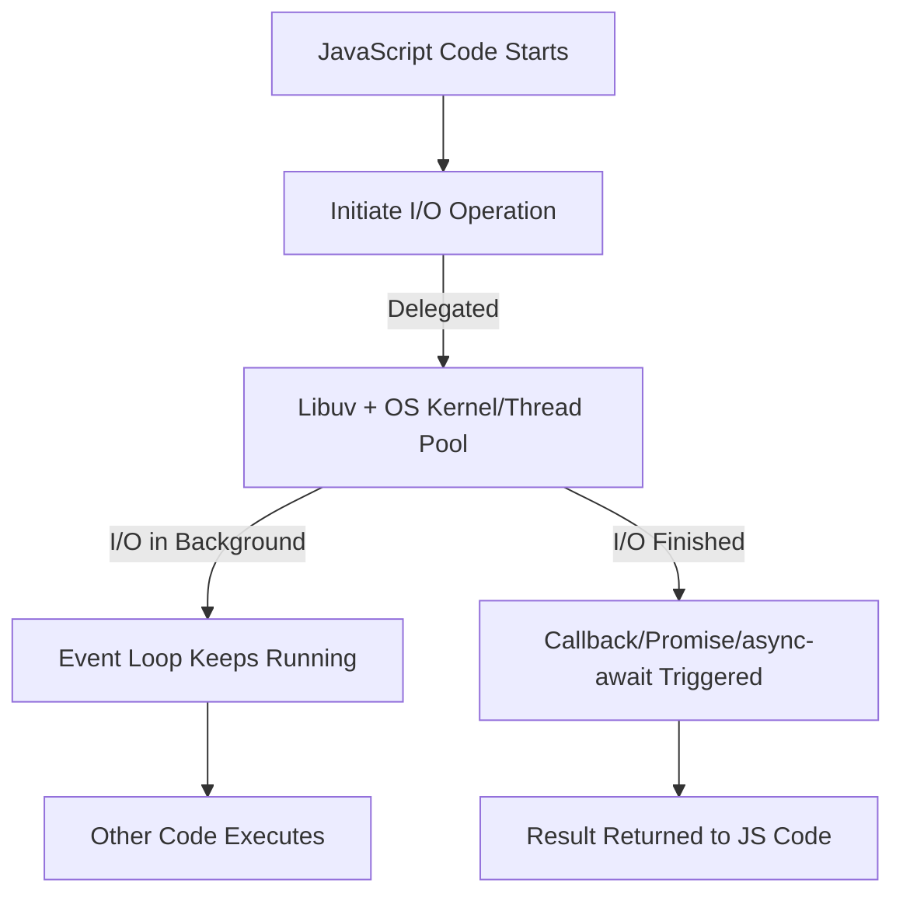

# Async I/O in Node.js

## 1. What is I/O?
I/O (**Input/Output**) means interacting with **external resources** outside the CPU/memory.  
Examples:
- Reading/Writing files  
- Network requests (HTTP, APIs, DB queries)  
- Accessing external devices  

These operations are **slow compared to CPU tasks** because they rely on disk or network speed.

---

## 2. What is Async I/O?
**Asynchronous I/O (Async I/O)** means:
- Node.js **starts an I/O operation** (like reading a file or making a request).  
- Instead of **waiting** for it to finish (blocking), Node.js continues running other code.  
- When the operation finishes, Node.js **notifies your program** via:
  - **Callback**
  - **Promise**
  - **async/await**  

This is possible because of **Event Loop + Libuv** in Node.js.

---

## 3. How it Works in Node.js
- Node.js uses **libuv** (C++ library) for handling async I/O.  
- Expensive I/O operations (disk, network) are delegated to the **OS kernel or thread pool**.  
- Node.js keeps the **main thread (event loop)** free to handle other requests.  

---

## 4. Example: Sync vs Async I/O

### Synchronous I/O (Blocking)
```js
const fs = require('fs');

const data = fs.readFileSync('demo.txt', 'utf8'); // Blocks here
console.log(data);
console.log("This runs after file is read");
```

🔴 Problem → Other tasks wait until file reading finishes.  

---

### Asynchronous I/O (Non-Blocking)
```js
const fs = require('fs');

fs.readFile('demo.txt', 'utf8', (err, data) => {
  if (err) throw err;
  console.log("File Content:", data);
});

console.log("This runs immediately without waiting!");
```

✅ Advantage → File reading happens in background, program doesn’t stop.  

---

## 5. Real-World Benefits of Async I/O
- **Scalability** → Can handle thousands of requests without blocking.  
- **Performance** → CPU is not wasted waiting for slow I/O.  
- **Better user experience** → App remains responsive.  

---

## 6. Mermaid Diagram – How Async I/O Works



---

## 7. Summary
- **Async I/O = Non-blocking Input/Output operations**.  
- Node.js delegates I/O tasks to **libuv + OS kernel**, keeps event loop free.  
- Makes Node.js **fast & scalable** for I/O-heavy applications (APIs, servers, DB calls).  
- For **CPU-heavy tasks**, you need Worker Threads (since Async I/O won’t help).  
