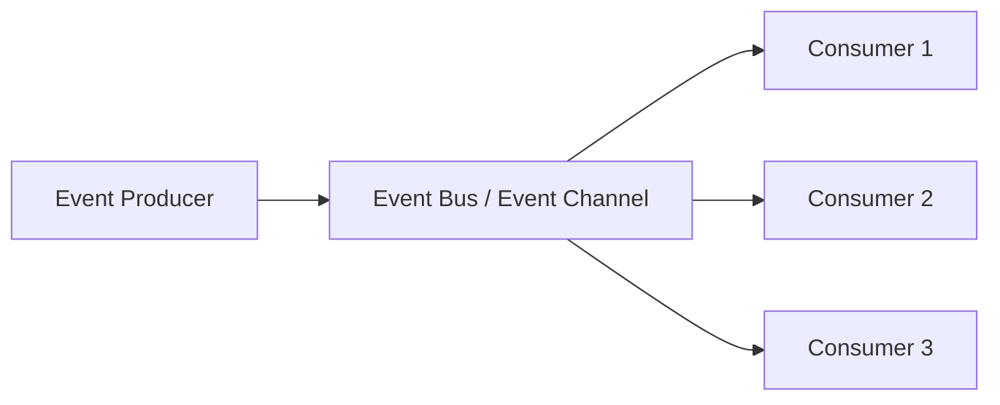

# Event-Driven Architecture (EDA) – Notes

## 1. Definition
Event-Driven Architecture is a **software design pattern** where the flow of the program is controlled by **events**.  
- An **event** = a significant change in state (like “user clicked a button”, “file uploaded”, “payment completed”).  
- The system reacts to events through **listeners/handlers** instead of executing code sequentially.  

👉 Instead of “Do A → then B → then C”, the system works like:  
**“When X happens → run Y”**.  

---

## 2. Core Components
1. **Event Producers (Emitters)**  
   - Generate events.  
   - Example: A user submitting a form, a sensor sending data, a service publishing a message.  

2. **Event Channel (Bus/Broker)**  
   - Medium that transfers events from producers to consumers.  
   - Example: Event loop in Node.js, Kafka, RabbitMQ, AWS EventBridge.  

3. **Event Consumers (Listeners/Handlers)**  
   - React to events by executing some logic.  
   - Example: Logging service, payment handler, email sender.  

---

## 3. How it Works
1. An **event** happens.  
2. The **producer emits** this event.  
3. The **event bus** delivers it.  
4. One or more **consumers** handle it (independently).  

---

## 4. Example in Node.js
```js
const EventEmitter = require('events');
const emitter = new EventEmitter();

// Consumer (listener)
emitter.on('orderPlaced', (orderId) => {
  console.log(`Processing order: ${orderId}`);
});

// Producer (emits event)
emitter.emit('orderPlaced', 101);
```

**Output:**
```
Processing order: 101
```

---

## 5. Real-Life Examples
- **E-commerce**:  
  - Event = “Order Placed”  
  - Listeners = Inventory Service, Billing Service, Email Notification  

- **Banking**:  
  - Event = “Money Transferred”  
  - Listeners = Transaction Logger, Fraud Detector, SMS Notifier  

- **Node.js** itself:  
  - HTTP server emits events like `request`, `connection`, etc.  

---

## 6. Advantages
- **Loose Coupling** → Producers and consumers don’t depend on each other.  
- **Scalability** → Easy to add new event listeners.  
- **Flexibility** → Same event can trigger multiple actions.  
- **Asynchronous** → Events handled without blocking.  

---

## 7. Disadvantages
- **Debugging Complexity** → Hard to trace flow (many events flying around).  
- **Event Storming** → Too many events may overwhelm system.  
- **Ordering Issues** → Events might not always arrive in order.  

---

## 8. Mermaid Diagram – Event Flow



---

## 9. Summary
- Event-Driven Architecture = **“When something happens → Do something.”**  
- Core of **Node.js, Microservices, Real-time apps, IoT systems**.  
- Built around **Producer → Event Bus → Consumer**.  
